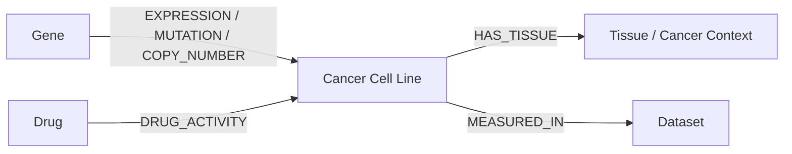
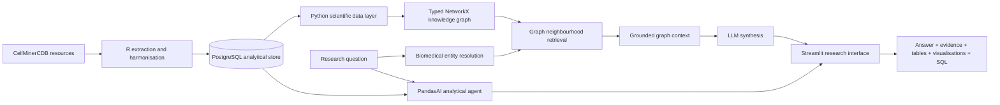

# CellMinerCDB GraphRAG

[](https://github.com/hasini-s-de-silva/CellMinerCDB-GraphRAG/actions/workflows/ci.yml)
[](https://www.python.org/downloads/release/python-3110/)

## GraphRAG for cancer pharmacogenomics and natural-language biomedical data analysis

**CellMinerCDB GraphRAG** is an open-source bioinformatics and scientific software project for exploring large-scale cancer pharmacogenomic data across genes, drugs, cancer cell lines, tissues and molecular measurements. It combines **CellMinerCDB, Python, R, PostgreSQL, biological knowledge graphs, NetworkX, GraphRAG, PandasAI, Azure OpenAI and Streamlit** in a reproducible research architecture.

The project addresses a practical bioinformatics problem: pharmacogenomic evidence is distributed across datasets, modalities and identifier systems, while many research questions require connecting molecular features to drug response across heterogeneous cancer models. CellMinerCDB GraphRAG creates a computational layer that harmonises these data, represents biological relationships as a typed knowledge graph, retrieves relevant graph neighbourhoods for a research question, and exposes the underlying data through natural-language analytical workflows.

## Highlights

- **Cancer genomics and pharmacogenomics:** integrates gene expression, mutation, copy-number and drug-activity measurements across CellMinerCDB-associated resources.
- **Biological knowledge graph:** models genes, drugs, cancer cell lines, tissues and datasets as typed NetworkX entities and relationships.
- **GraphRAG retrieval:** resolves biomedical entities from natural-language questions, retrieves bounded graph neighbourhoods and serialises evidence for grounded LLM synthesis.
- **Python and R interoperability:** combines R-based CellMinerCDB extraction with Python scientific computing and AI workflows.
- **Large-scale data engineering:** uses indexed PostgreSQL storage for a long-format analytical resource designed for hundreds of millions of observations.
- **Natural-language analysis:** integrates PandasAI and Azure OpenAI for interactive exploration and analytical code generation.
- **Reproducibility and traceability:** preserves source identifiers, generated SQL and explicit graph evidence for scientific review.
- **Research software engineering:** includes containerised deployment, environment-based configuration, modular graph components, automated tests and continuous integration with GitHub Actions.

## Biological data model

The analytical layer links five principal biological entity classes:



Each measurement edge retains available provenance such as source dataset, modality and numerical value. This allows graph retrieval to return not only connected entities, but also the evidence supporting those relationships.

## GraphRAG architecture



The GraphRAG implementation is intentionally separated into deterministic retrieval and optional generation. `PharmacogenomicGraph` constructs and queries the biological graph. `GraphRAGEngine` resolves entities, retrieves local biological context and prepares evidence for an injected language-model generator. This design keeps graph evidence inspectable and testable independently of any specific LLM provider.

## Data resources and modalities

The supplied extraction workflow references CellMinerCDB-associated resources including **CCLE, GDSC, CTRP, NCI Sarcoma, Uni Sarcoma and MDA Mills** where locally available. Dataset files are not redistributed by this repository.

Supported long-format modalities include:

| Code | Biological modality | Graph relationship |
|---|---|---|
| `exp` | Gene expression | `EXPRESSION` |
| `mut` | Mutation | `MUTATION` |
| `cop` | Copy number | `COPY_NUMBER` |
| `act` | Drug activity / response | `DRUG_ACTIVITY` |

The PostgreSQL schema retains canonical and original identifiers, tissue context, drug mechanism metadata and synonyms where available. This supports cross-dataset harmonisation while preserving provenance.

## Example research questions

The architecture supports questions such as:

- Which molecular features are connected to response to a selected drug across cancer cell lines?
- How does a gene's expression vary across cancer models and tissues?
- Which drugs and molecular measurements are connected to a specific cancer cell line?
- What local pharmacogenomic evidence connects a gene, drug and cancer model?
- Are observed gene-drug associations represented consistently across multiple pharmacogenomic resources?

GraphRAG retrieval is evidence-oriented. Retrieved relationships should be interpreted as dataset observations or associations, not causal or clinical conclusions.

## Repository structure

```text
.
├── .github/
│   └── workflows/
│       └── ci.yml                     # Automated GitHub Actions test workflow
├── cellminer_ai/
│   ├── __init__.py
│   ├── graph.py                    # Typed biological knowledge graph
│   └── graphrag.py                 # Entity resolution and GraphRAG retrieval
├── tests/
│   └── test_graphrag.py            # Knowledge-graph and retrieval tests
├── examples/
│   ├── graphrag_demo.py            # Minimal executable GraphRAG example
│   └── RESEARCH_QUESTIONS.md       # Research question patterns
├── docs/
│   ├── ARCHITECTURE.md             # Detailed system design
│   ├── DATA.md                     # Data model and provenance
│   ├── REPRODUCIBILITY.md          # Reproducible analysis principles
│   └── SECURITY.md                 # LLM and database security considerations
├── streamlit_pandasai_chatbot.py   # Interactive research application
├── pandasai_helper.py              # PostgreSQL and PandasAI integration
├── local.r                         # CellMinerCDB extraction and local database load
├── uploader_optimized.r            # Scalable PostgreSQL transfer utility
├── Dockerfile
├── docker-compose.yml
├── pyproject.toml
├── env.example
├── CONTRIBUTING.md
└── LICENSE
```

## Engineering design

### Data engineering

`local.r` extracts available CellMinerCDB molecular and drug-response matrices, converts them into a common long format, retains source identifiers, applies canonical mappings and loads the harmonised resource into PostgreSQL. The database layer uses indexes across high-value retrieval dimensions including dataset, modality, cell line and biological feature.

`uploader_optimized.r` provides an optional transfer path for large local PostgreSQL resources using key-based pagination, checkpoint-aware processing and bulk-oriented database operations.

### Knowledge graph

`cellminer_ai/graph.py` converts harmonised observations into a typed `networkx.MultiDiGraph`. The graph preserves multiple measurements between the same biological entities, which is important when relationships originate from different datasets or modalities.

Entity classes include:

- `gene`
- `drug`
- `cell_line`
- `tissue`
- `dataset`
- fallback `feature` entities for additional modalities

### GraphRAG

`cellminer_ai/graphrag.py` implements the retrieval layer:

1. extract candidate biomedical terms from the research question;
2. resolve terms against graph labels and available synonyms;
3. retrieve a bounded multi-hop biological neighbourhood;
4. serialise relationships with dataset and measurement evidence;
5. optionally pass the retrieved context to an injected LLM generator;
6. return the matched entities, subgraph, evidence context and generated answer as a structured result.

This approach makes the retrieval step transparent and allows graph behaviour to be tested without relying on nondeterministic model output.

### Natural-language analytics

The existing Streamlit and PandasAI layer complements GraphRAG with direct analytical access to PostgreSQL. Generated SQL can be captured for traceability, and analytical outputs can be returned as tables, downloadable data and visualisations.

## Continuous integration and automated validation

Every push to `main` and every pull request triggers the GitHub Actions CI workflow in `.github/workflows/ci.yml`. The workflow provisions a clean Python 3.11 environment, installs the project from `pyproject.toml` and executes the automated test suite with pytest.

This provides an independent, reproducible check that the knowledge-graph and GraphRAG components remain installable and that tested retrieval behaviour continues to pass as the codebase evolves. The live CI status is exposed at the top of this README.

## Reproducibility and scientific integrity

CellMinerCDB AI is a **research prototype**, not a clinical decision-support system. Cross-study pharmacogenomic comparisons can be affected by assay design, preprocessing, batch effects, coverage and measurement definitions. Identifier harmonisation reduces naming inconsistency but does not remove biological or technical heterogeneity.

LLM-generated analyses, code, statistics and biological interpretations require independent scientific review. Graph relationships represent retrieved evidence from the loaded datasets and do not establish causation, therapeutic efficacy or clinical validity.

The project therefore prioritises:

- explicit source and identifier provenance;
- inspectable graph relationships;
- bounded evidence retrieval;
- generated SQL capture where available;
- separation of deterministic retrieval from generative synthesis;
- testable scientific software components;
- environment-based configuration and reproducible deployment.

## Technology stack

**Bioinformatics:** CellMinerCDB, cancer genomics, pharmacogenomics, biological networks, biomedical entity harmonisation  
**Programming:** Python, R, SQL  
**Data:** pandas, NumPy, PostgreSQL, Biobase, data.table  
**Graph AI:** NetworkX, knowledge graphs, GraphRAG, retrieval-augmented generation  
**AI:** PandasAI, Azure OpenAI, natural-language analytics  
**Application:** Streamlit, Matplotlib  
**Engineering:** GitHub Actions CI, Docker, Docker Compose, pytest, environment-based configuration

## Attribution

This repository builds on an existing CellMinerCDB/PandasAI codebase and associated open-source work. The included licence and upstream attribution should be preserved in derivative use. CellMinerCDB datasets and related resources remain subject to their own upstream licences and citation requirements.

Contributions described in a portfolio or CV should correspond to code or documentation personally implemented or materially changed by the contributor.

## Licence

See [`LICENSE`](LICENSE).
