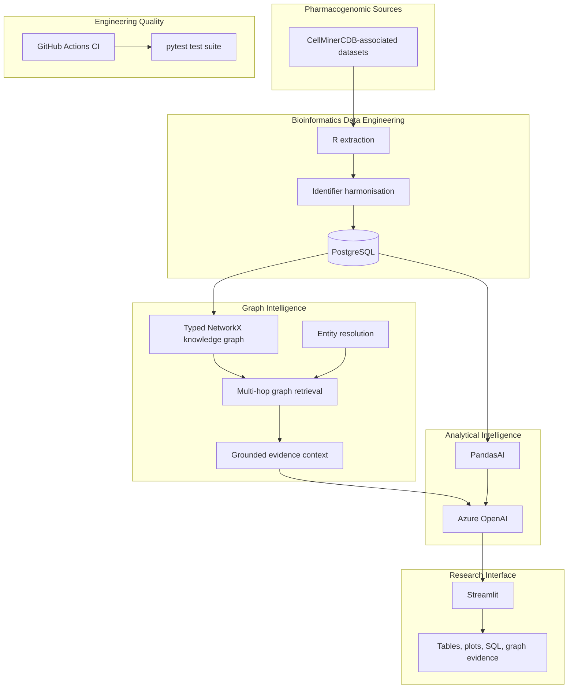

# System Architecture

## Overview

CellMinerCDB AI combines cancer pharmacogenomic data engineering, biological knowledge graphs, GraphRAG retrieval and natural-language analytics in a modular research software architecture.



## R extraction and harmonisation

`local.r` reads locally available CellMinerCDB resources, extracts molecular and drug-response matrices, converts measurements to a common long format, retains original identifiers, applies canonical cell-line and drug mappings, enriches metadata and writes the result to PostgreSQL.

Recognised modalities include expression, mutation, copy number and drug activity where available.

## PostgreSQL analytical store

PostgreSQL acts as the scalable source of truth for harmonised observations. Indexing supports common retrieval dimensions such as dataset, modality, feature and cell line. Original identifiers are retained alongside canonical identifiers to support provenance and debugging.

`uploader_optimized.r` provides an optional large-table transfer path with key-based pagination and bulk-oriented database operations.

## Biological knowledge graph

`cellminer_ai.graph.PharmacogenomicGraph` projects harmonised observations into a typed `networkx.MultiDiGraph`.

The graph uses explicit entity classes and biological relations:

```text
Gene      -> Cancer Cell Line : EXPRESSION | MUTATION | COPY_NUMBER
Drug      -> Cancer Cell Line : DRUG_ACTIVITY
Cell Line -> Tissue           : HAS_TISSUE
Cell Line -> Dataset          : MEASURED_IN
```

A multigraph is used because the same pair of entities may have multiple measurements from different datasets or modalities. Measurement edges preserve dataset, data type and numerical value when available.

## GraphRAG retrieval

`cellminer_ai.graphrag.GraphRAGEngine` separates retrieval from generation.

The retrieval sequence is:

1. parse candidate biomedical terms from a natural-language research question;
2. resolve candidate terms against graph labels and synonyms;
3. expand a bounded multi-hop neighbourhood around matched entities;
4. serialise graph edges into compact evidence statements;
5. provide the retrieved evidence to an optional language-model generator;
6. return a structured object containing entities, subgraph, evidence and answer.

This separation is deliberate. Entity matching and graph retrieval can be unit tested independently from LLM behaviour, and the retrieved evidence remains inspectable during scientific review.

## Natural-language analytical layer

`pandasai_helper.py` exposes PostgreSQL through PandasAI metadata and handles canonical alias processing. `streamlit_pandasai_chatbot.py` provides the interactive application, analytical orchestration, output rendering and SQL trace capture.

GraphRAG and PandasAI solve different parts of the research problem. GraphRAG retrieves relational biological context. PandasAI supports numerical and tabular analysis over the underlying observations.

## Engineering principles

- deterministic retrieval before generative synthesis;
- explicit biological entity and relation types;
- provenance retained at measurement level;
- modular Python components with unit tests;
- environment-based secrets and configuration;
- containerised execution;
- least-privilege database access for interactive analysis;
- clear separation between observed evidence and generated interpretation.


## Continuous integration

The repository uses GitHub Actions for automated validation on pushes to `main` and pull requests targeting `main`. The CI workflow creates a clean Python 3.11 environment, installs the package from `pyproject.toml` and runs the pytest suite.

CI is intentionally isolated from external LLM credentials and production databases. Core knowledge-graph construction and GraphRAG retrieval can therefore be validated deterministically without requiring Azure OpenAI access or a live CellMinerCDB PostgreSQL instance. This keeps automated checks reproducible, secure and suitable for external contributions.
